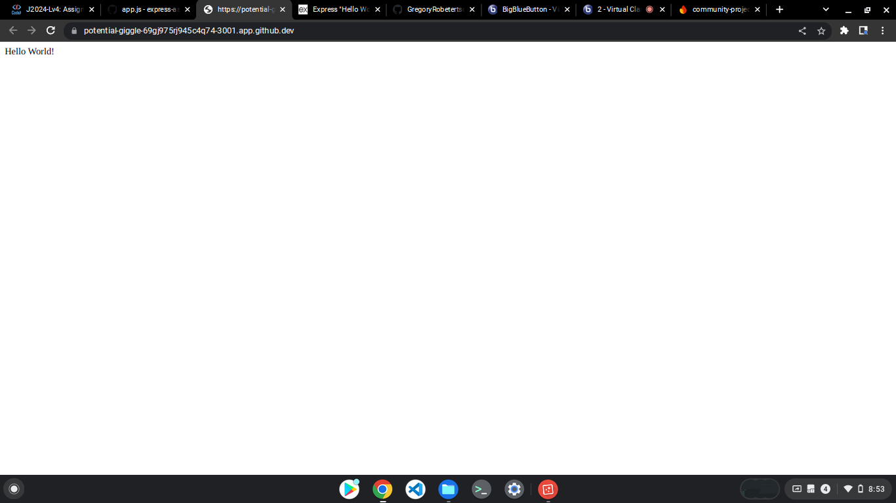
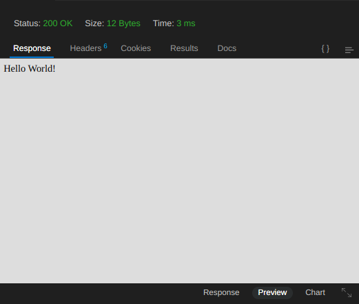
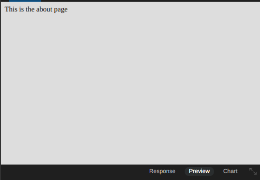
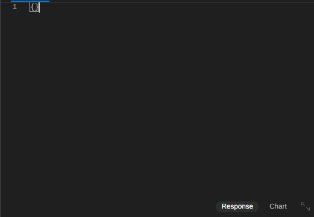

# express-assignment-1

# Express.js Server Setup Summary

## Purpose:
The provided code sets up an Express.js server, configuring routes and middleware to handle incoming requests.

## Key Components:

1. **use strict**
   - Enables strict mode in JavaScript, enforcing a stricter set of rules for coding.

2. **Express.js Initialization**
   - Initializes an Express application using the `express` module.

3. **Port Configuration**
   - Sets up the server to listen on port `3001` by default, falling back to port `3002` if `3001` is unavailable.

4. **Middleware Setup**
   - Uses the `body-parser` middleware to parse incoming request bodies, specifically for JSON data.

5. **Route Definitions**
   - **Root Route**: Responds with 'Hello World!' when a GET request is made to `/`.
   - **About Route**: Responds with 'This is the about page' when a GET request is made to `/about`.
   - **Data Route**: Responds with the JSON data received in the request body when a POST request is made to `/data`.

6. **Server Start**
   - Starts the Express server, listening on the specified port, and logs a message indicating the port it's listening on.

## Overall:
This code sets up a basic Express.js server with routes for serving content and handling POST requests.
